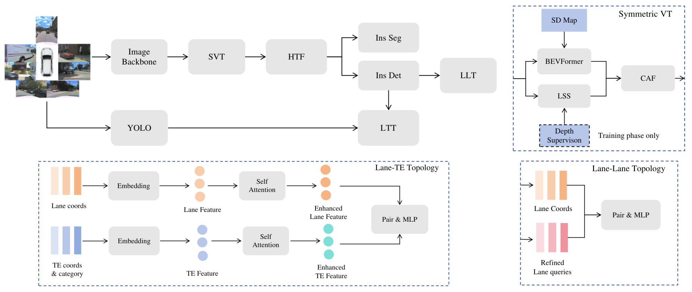
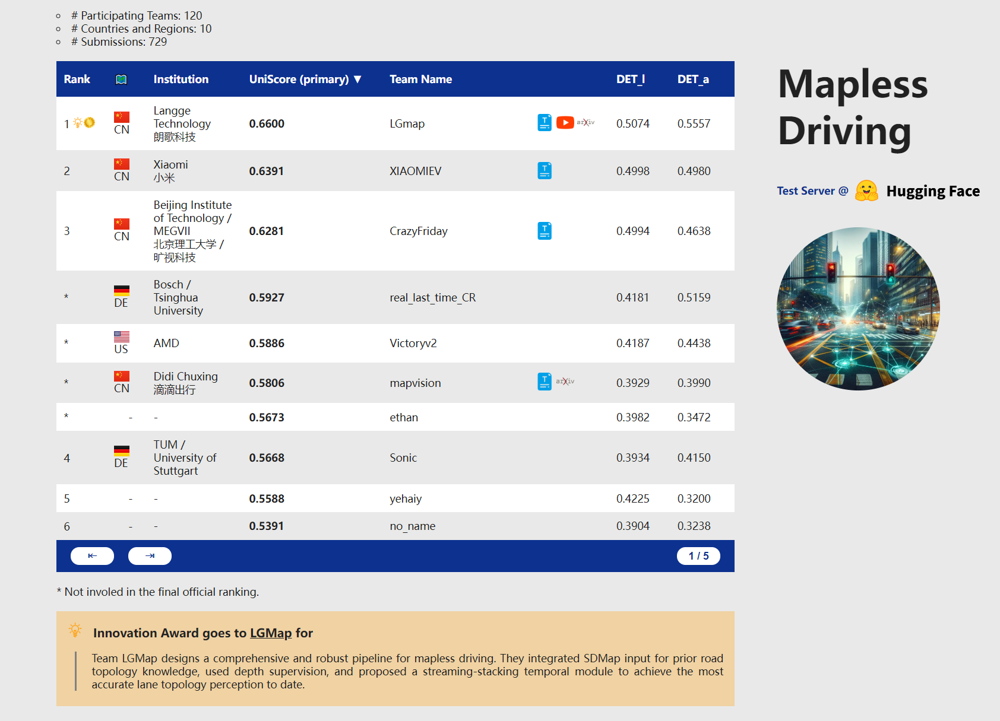

<div align="center">
  <h1>LGmap</h1>
  
  <h3> Local-to-Global Mapping Network for Online Long-Range Vectorized
HD Map Construction </h3>
  Kuang Wu · Sulei Nian · Can Shen · Chuan Yang · Zhanbin Li

  Langge Technology

  [](https://arxiv.org/abs/2406.13988)
  [](https://youtu.be/bTqRLw2ONKQ)
  
</div>

#
### News
* **`Feb. 27th, 2025`:** :clap: Check out our latest work, **InteractionMap**, accepted by CVPR 2025 ! This study improves previous map vectorization methods by fully leveraging local-to-global information interaction in both time and space. (**[Project](https://kuangwu.github.io/interactionmap/) , [Code](https://github.com/kuangwu/interactionmap), [Paper](https://arxiv.org/abs/2503.21659)**)
* **`Jun. 8th, 2024`:** :bulb: The **Innovation-Award** of the Mapless Driving-Challenge goes to our LGMap Solution ! (**[Tech-Report](https://arxiv.org/abs/2406.13988) , [Video](https://youtu.be/bTqRLw2ONKQ)**)
* **`Jun. 1st, 2024`:** :trophy: Our team win the **Championship** of the CVPR24 *Mapless Driving Challenge* ! (**[Leaderboard](https://opendrivelab.com/challenge2024/#mapless_driving)**)


<!-- Using HTML to center the abstract -->
<div class="columns is-centered has-text-centered">
    <div class="column is-four-fifths">
        <h2>Abstract</h2>
        <div class="content has-text-justified">
Vectorized high-definition (HD) maps are essential for
an autonomous driving system. We introduce a novel online mapping
pipeline LGmap, which adept at long-range temporal model.
Firstly, we propose symmetric view transformation(SVT),
a hybrid view transformation module. 
Our approach overcomes the limitations of 
forward sparse feature representation and utilizing depth perception and SD prior information.
Secondly, we propose hierarchical temporal fusion(HTF)
module. It employs temporal information from local to global,
which empowers the construction of long-range HD map
with high stability. Lastly, we propose a novel ped-crossing
resampling. The simplified ped crossing representation accelerates the instance attention based decoder convergence performance. 
Our method achieves 0.66 UniScore in the Mapless Driving OpenLaneV2 test set.
        </div>
    </div>
</div>

---

## Method
- We propose **LGmap**, which improves previous map vectorization methods by fully leveraging local-to-global information interaction in both time and space.



- The overall model architecture of **LGmap**. The entire model is consists of mainly six components: a image backbone equipped with **SVT(Symmetric View Transformation)**, a **hierarchical temporal fusion(HTF) module**, a unified **instance detection and segmentation
predictor**, a **traffic elements detector**(YOLO), a **Lane-Lane Topology(LLT)** and a **Lane-TE Topology(LTT)**


## Result

- Comparison with SOTA methods, LGmap is the 1st-place solution of the CVPR24 *Mapless Driving Challenge, which achieves 0.66 UniScore.
  

  
  
- We visualize results of LGMap in sequential frames. (**[Demo](https://github.com/kuangwu/lgmap/raw/refs/heads/main/resource/Openlanev2LGmap.mp4)**)
  
## Citation
```
@article{wu2024lgmap,
  title={LGmap: Local-to-Global Mapping Network for Online Long-Range Vectorized HD Map Construction},
  author={Wu, Kuang and Nian, Sulei and Shen, Can and Yang, Chuan and Li, Zhanbin},
  journal={arXiv preprint arXiv:2406.13988},
  year={2024}
}
```
